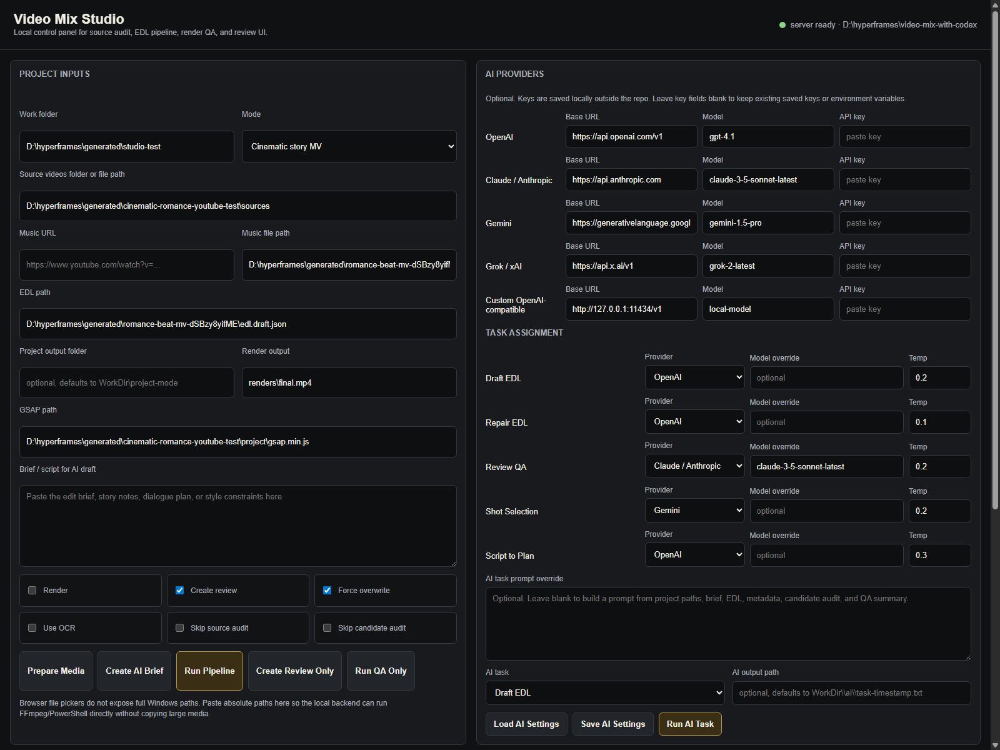

# Video Mix With Codex

A practical workflow for editing music videos with Codex, FFmpeg, and HyperFrames.

The project is built around a simple idea: do not pick video timestamps blindly. First understand the song, screen the footage, decide what every shot and audio line is doing, then render and QA the result before delivery.



Sample output: [samples/final-16x9-99.008s.mp4](samples/final-16x9-99.008s.mp4)

It supports two common edit styles:

- **Beat-cut MV**: the music drives the edit, with cuts and visual accents placed on beats or phrase changes.
- **Cinematic story MV**: the song carries the emotion, while selected dialogue and character-focused shots tell a clear story.
- **Reference-driven social short**: a TikTok/Reels/Shorts reference is analyzed into a style brief, pacing map, caption system, effect stack, and EDL defaults before cutting.

## Core Workflow

1. **Prepare media**
   - Put your music and source videos in a project folder.
   - Keep original media outside this repo, or in ignored folders such as `source/`, `media/`, or `generated/`.
   - Use one clean music track whenever possible.

2. **Inspect every source**
   - Probe duration, fps, resolution, audio streams, and codec.
   - Check whether the source contains episode cards, intro/outro cards, credits, hard subtitles, logos, or random SFX.
   - For narrative sources, treat source video audio as unsafe by default.

3. **Create contact sheets**
   - Make visual sheets from each video before selecting shots.
   - For every candidate shot, inspect start, middle, and end frames.
   - Reject ranges with title cards like `EP 04`, credits, unrelated subtitles, black frames, or repeated filler.

4. **Build the story and timing**
   - For a beat-cut MV, map song sections: intro, lift, drop, bridge, climax, ending.
   - For a cinematic MV, write the emotional arc first: whose POV, what changes, where the reveal lands.
   - For a social short reference, classify the mode first: anime/game lyric edit, captioned explainer, or cinematic character short.
   - Keep each shot's reason in the EDL. If a shot has no story or rhythm purpose, cut it.

5. **Assign audio roles**
   - `music_bed`: the main song.
   - `dialogue_line`: a short, intentional dialogue line that matches the visible moment.
   - `diegetic_sfx`: a source sound kept on purpose.
   - `muted_visual`: normal default for source footage.

6. **Generate, render, and QA**
   - Generate a HyperFrames project from an EDL.
   - Run `lint`, `validate`, `inspect`, snapshots, render, blackdetect, and final frame review.
   - Do not deliver if the final MP4 has black frames, accidental subtitles, wrong dialogue, rough template transitions, or audio that masks important speech.

## Requirements

- Windows PowerShell
- FFmpeg and FFprobe on `PATH`
- Node.js 22+
- HyperFrames CLI through `npx hyperframes`

Optional:

- `yt-dlp` for downloading a reference music track or source video when you have the right to use it.
- Bun, if you are working inside the HyperFrames monorepo.

Run the environment check before starting a new machine or project:

```powershell
.\scripts\Test-Environment.ps1
```

Run the aesthetic EDL check before generating or rendering. It catches videos
that are technically valid but likely to feel flat: missing style mode, overly
uniform shot rhythm, repeated sources, dense flash stacks, bad effect targets,
caption density, mojibake, and vertical crops without reframe data.

```powershell
bun run qa:aesthetic -- -Edl D:\video-renders\my-mix\edl.json
```

## Local Studio UI

Start the local control panel:

```powershell
npm run studio
```

Then open `http://127.0.0.1:4327`.

The Studio UI lets you paste Windows paths for source videos, music, EDL, output folders, and an edit brief. From the browser you can:

- Prepare media: download/probe music, probe sources, and create source contact sheets.
- Create an AI brief file for Codex to draft an EDL from the selected inputs.
- Configure optional AI providers: OpenAI, Claude/Anthropic, Gemini, Grok/xAI, or a custom OpenAI-compatible endpoint.
- Assign tasks to specific providers: draft EDL, repair EDL, QA review, shot selection, or script-to-plan.
- Run the full pipeline: validate EDL, candidate audit, generate project, optional render, QA, and review page.
- Run QA only or regenerate the review UI for an existing project.
- Watch job logs live without switching terminals.

Because browser file pickers do not expose absolute local paths, the first Studio version uses pasteable full paths instead of uploading large videos. This keeps FFmpeg working directly on original media and avoids slow copies.

AI providers are optional. Studio saves provider settings outside the repo at `%APPDATA%\video-mix-with-codex\ai-settings.json` on Windows, so API keys are not committed. You can also use environment variables such as `OPENAI_API_KEY`, `ANTHROPIC_API_KEY`, `GEMINI_API_KEY`, or `XAI_API_KEY`. The AI layer drafts, repairs, or reviews edit decisions; FFmpeg, HyperFrames rendering, and QA remain local and deterministic.

## Social Short Skill

The repo includes `skills/social-short-video-editor`, a Codex skill for turning reference shorts into reusable edit grammar. Use it when a user gives a TikTok/Reels/Shorts-style reference and asks for a similar edit. It covers anime/game lyric edits, caption-led science or story explainers, and cinematic character shorts.

The skill requires a style brief before an EDL: output format, hook, pacing, cut policy, caption/lyric behavior, effect stack, audio roles, reject rules, and QA times. Its detailed reference grammar lives in `skills/social-short-video-editor/references/short-form-style-grammar.md`.

## Effect Catalog

The repo includes a machine-readable effect catalog at `effects/catalog.json`. When AI drafts an EDL, it should choose from that catalog and write top-level `effects[]` cues:

```json
{
  "id": "fx-01",
  "type": "flash-through-white",
  "timelineStart": 3.2,
  "duration": 0.18,
  "target": "global",
  "color": "#fff5d6",
  "intensity": 1
}
```

Supported HyperFrames runtime effects include `flash-through-white`, `impact-pulse`, `cinematic-zoom`, `whip-zoom`, `frame-border`, `chromatic-radial-split`, `vignette-swell`, `beat-freeze`, `anamorphic-flare`, `hud-scan`, `shake-hit`, `letterbox-pulse`, `negative-space-reset`, `subtitle-slam`, and `hold-bloom`. Shot-level `preprocessEffects[]` can also bake FFmpeg effects into extracted clips before assembly, including `cinematic-grade`, `cold-space-grade`, `rgb-shift`, `vignette-native`, `frei0r-glow`, `frei0r-contrast0r`, `frei0r-saturat0r`, and `frei0r-distort0r`. Frei0r effects require installed Frei0r plugins; if FFmpeg exposes `frei0r` but a plugin is missing, the generator logs a warning and uses a native FFmpeg fallback.

True speed ramps or freeze-frame media retiming should be created during FFmpeg shot preprocessing, then referenced as normal shots in the EDL.

## Captions

Add `captions[]` to the EDL when the video needs social hook text, lyric punches, or spoken emphasis. The beat-cut template renders these as animated safe-area overlays. Use `tone` to choose visual weight and `position` to avoid covering important subjects.

```json
{
  "captions": [
    {
      "id": "caption-01",
      "timelineStart": 0.35,
      "duration": 1.7,
      "text": "Cold open",
      "tone": "soft",
      "position": "bottom"
    },
    {
      "id": "caption-02",
      "timelineStart": 5.95,
      "duration": 1.4,
      "text": "No mercy",
      "tone": "impact",
      "position": "middle"
    }
  ],
  "effects": [
    {
      "type": "subtitle-slam",
      "timelineStart": 6.15,
      "duration": 0.34,
      "target": "caption-02"
    }
  ]
}
```

Supported caption tones are `default`, `soft`, `alert`, and `impact`. Supported positions are `bottom`, `top`, `middle`, and `center`.

## Smart Reframe

Character-focused edits should not rely on automatic center crop. Add `reframe` to each shot when the subject is off-center, moving, or when the source is landscape but the edit is vertical.

Static subject crop:

```json
{
  "id": "shot-03",
  "source": "D:/media/source.mp4",
  "sourceStart": 42.2,
  "timelineStart": 5.35,
  "duration": 1.4,
  "reframe": {
    "mode": "manual",
    "scaleMode": "height",
    "x": 690,
    "y": 0,
    "subject": "main character close-up"
  }
}
```

Moving subject crop:

```json
{
  "id": "shot-04",
  "source": "D:/media/source.mp4",
  "sourceStart": 53.8,
  "timelineStart": 6.75,
  "duration": 1.2,
  "reframe": {
    "mode": "keyframes",
    "scaleMode": "height",
    "keyframes": [
      { "t": 0, "x": 520, "y": 0 },
      { "t": 0.55, "x": 650, "y": 0 },
      { "t": 1.2, "x": 760, "y": 0 }
    ],
    "subject": "face and upper body"
  }
}
```

Use `manual` for locked-off shots and `keyframes` for shots where the face/body crosses the frame. The generator smooths between keyframes and clamps the crop to the scaled source bounds. After adding reframe data, always run a candidate audit or final frame contact sheet; the row should keep the character readable at start, middle, and end.

You can generate a first-pass keyframe path from an initial subject box with OpenCV CSRT:

```powershell
python .\scripts\New-ReframePath.py `
  --source D:\media\source.mp4 `
  --start 20.1 `
  --duration 2.2 `
  --box 820,140,360,740 `
  --target-width 1080 `
  --target-height 1920 `
  --scale-mode height `
  --subject "main character face and upper body" `
  --out D:\video-renders\my-mix\reframes\shot-04.reframe.json
```

This requires `opencv-contrib-python`. Treat the generated path as an assistant, not final truth: paste it into the shot, create a candidate audit sheet, and adjust bad keyframes manually.

### Frei0r Doctor

Check whether FFmpeg can actually load Frei0r plugins:

```powershell
npm run frei0r:doctor -- -Json
```

If the plugin DLLs live outside a standard location, pass the plugin folder or set `FREI0R_PATH`:

```powershell
.\scripts\Get-Frei0rStatus.ps1 -Frei0rPath "C:\Program Files\Kdenlive\lib\frei0r-1"
.\scripts\Invoke-VideoMixPipeline.ps1 -WorkDir D:\video-renders\mv -Edl D:\video-renders\mv\edl.json -Frei0rPath "C:\Program Files\Kdenlive\lib\frei0r-1" -RequireFrei0r
```

Use `-RequireFrei0r` when the edit must fail if a requested Frei0r plugin is missing. Without it, the generator logs the missing plugin and uses a native FFmpeg fallback so the render can still complete.

## Quick Start: Beat-Cut MV

Copy the example EDL, update paths, then generate and render:

```powershell
Copy-Item .\examples\edl.example.json D:\video-renders\my-mix\edl.json

.\scripts\New-VideoMixProject.ps1 `
  -Edl D:\video-renders\my-mix\edl.json `
  -OutDir D:\video-renders\my-mix\project

.\scripts\Render-VideoMix.ps1 `
  -ProjectDir D:\video-renders\my-mix\project

.\scripts\Test-VideoMix.ps1 `
  -ProjectDir D:\video-renders\my-mix\project
```

Use this when you want a clean montage driven mostly by rhythm and visual energy.

## Fast Pipeline

For repeat jobs, use the pipeline script to run the mechanical parts in one pass:

```powershell
.\scripts\Invoke-VideoMixPipeline.ps1 `
  -WorkDir D:\video-renders\my-story-mv `
  -Sources D:\video-renders\my-story-mv\sources `
  -MusicUrl "https://www.youtube.com/watch?v=..." `
  -Edl D:\video-renders\my-story-mv\edl.json `
  -Mode Cinematic `
  -Render `
  -CreateReview `
  -Force
```

Without `-Edl`, the script prepares media only: music download, ffprobe metadata, 8s and 6s source contact sheets. With `-Edl`, it validates the EDL, creates the candidate audit, generates the HyperFrames project, and optionally renders plus runs final QA.

Generated projects now cache normalized shot clips under `.shot-cache` next to the project work directory. Re-running after small EDL/template fixes reuses unchanged shots instead of re-encoding every clip. Pass `-NoCache` to the project generator when you need a completely fresh extraction.

## Quick Start: Cinematic Story MV

Copy the cinematic EDL when the edit needs a character arc, selected dialogue, and restrained transitions:

```powershell
Copy-Item .\examples\cinematic-character-edl.example.json D:\video-renders\my-story-mv\edl.json

.\scripts\New-CinematicEditProject.ps1 `
  -Edl D:\video-renders\my-story-mv\edl.json `
  -OutDir D:\video-renders\my-story-mv\project

.\scripts\Render-VideoMix.ps1 `
  -ProjectDir D:\video-renders\my-story-mv\project `
  -SnapshotAt "0.5,5,12,24,36,48,60,75,90"

.\scripts\Test-VideoMix.ps1 `
  -ProjectDir D:\video-renders\my-story-mv\project `
  -Times "0.5,5,12,24,36,48,60,75,90"
```

Use this for edits like a romance MV, character tribute, trailer-style story montage, or any source where dialogue can easily become chaotic if not controlled.

## Audit Before Editing

Create contact sheets for source videos:

```powershell
.\scripts\New-ContactSheet.ps1 `
  -Path D:\video-renders\my-story-mv\sources `
  -OutDir D:\video-renders\my-story-mv\audit\source-sheets `
  -IntervalSec 8
```

After drafting an EDL, create a candidate audit sheet from the exact selected ranges:

```powershell
.\scripts\New-CandidateAudit.ps1 `
  -Edl D:\video-renders\my-story-mv\edl.json `
  -OutDir D:\video-renders\my-story-mv\audit\candidates
```

Review `candidate-audit-sheet.jpg` before rendering. Each row shows start, middle, and end frames for a selected shot. If a row shows an episode card, unrelated subtitle, credit, black frame, or mismatched character moment, fix the EDL first.

For vertical or character edits, also verify `reframe` on every tight shot. A usable candidate row should keep the face, eye, hand, or action detail inside the crop for all three frames; otherwise add `manual` or `keyframes` reframe data before rendering.

## EDL Basics

An EDL is a JSON edit decision list. It tells the scripts what to extract and where to place it on the timeline.

Use the schema for editor hints:

```json
{
  "$schema": "./schemas/edl.schema.json"
}
```

Validate a real EDL after replacing placeholder media paths:

```powershell
.\scripts\Validate-Edl.ps1 -Edl D:\video-renders\my-story-mv\edl.json
```

Minimum structure:

```json
{
  "project": {
    "title": "Melting Down",
    "kicker": "Character POV",
    "width": 1920,
    "height": 1080,
    "fps": 24,
    "duration": 110.736
  },
  "music": {
    "path": "D:/media/music.m4a",
    "start": 0,
    "duration": 110.736,
    "volume": 0.52,
    "fadeIn": 0.8,
    "fadeOut": 3.2
  },
  "shots": [
    {
      "id": "shot-01",
      "source": "D:/media/source-01.mp4",
      "sourceStart": 15,
      "timelineStart": 0,
      "duration": 5.5,
      "trackIndex": 0,
      "audioRole": "muted_visual",
      "storyBeat": "He waits alone before noticing her.",
      "visualRisk": "clean range; no title card"
    }
  ],
  "dialogue": [
    {
      "id": "dialogue-01",
      "source": "D:/media/source-03.mp4",
      "sourceStart": 75.35,
      "timelineStart": 49.05,
      "duration": 3.35,
      "volume": 1.45,
      "fadeIn": 0.08,
      "fadeOut": 0.18
    }
  ],
  "captions": []
}
```

For a full-song MV, set `project.duration` and `music.duration` to the measured duration of the song. A tiny encode-level difference of a few frames is normal after final MP4 export.

## Shot Selection Rules

- Prefer meaningful close-ups, hands, glances, walking direction, and clear emotional reversals.
- Avoid repeating the same image unless it is a deliberate callback.
- Avoid obvious curtain, slide, left/right wipe, and template-style transitions.
- Use crossfades only when the two shots belong to the same emotional phrase.
- Do not use source intro cards, episode cards, end cards, credits, or channel screens as story footage.
- If burned-in subtitles conflict with the edit, choose another range or mask them with a letterbox treatment.

## Audio Mix Rules

- Keep the song as the main bed.
- Keep source footage muted unless a line or SFX is intentionally listed in the EDL.
- Use only a few dialogue lines in an MV; too many turns it into a recap scene.
- Place dialogue on quieter parts of the song or reduce music volume in the EDL.
- Dialogue should be clearly intelligible, but it should not feel pasted on top of the song.
- After render, check the final MP4 with `volumedetect` or a manual listen pass at start, middle, climax, and ending.

Example final audio check:

```powershell
.\scripts\Test-AudioMix.ps1 -FinalMp4 D:\video-renders\my-story-mv\project\renders\final.mp4
```

Create a limiter-balanced copy when peaks are too close to `0 dB`:

```powershell
.\scripts\Test-AudioMix.ps1 `
  -FinalMp4 D:\video-renders\my-story-mv\project\renders\final.mp4 `
  -CreateBalanced
```

## Vertical Version

After a landscape render, create a 1080x1920 version for TikTok, Shorts, or Reels:

```powershell
.\scripts\New-VerticalVersion.ps1 `
  -InputMp4 D:\video-renders\my-mix\project\renders\final.mp4 `
  -OutputMp4 D:\video-renders\my-mix\project\renders\final_vertical.mp4
```

Review the vertical crop manually. Character edits often need custom crop decisions because faces and hands matter more than center framing.

For best results, prefer building a vertical project directly with per-shot `reframe` instead of converting a finished landscape render. The vertical converter is useful for quick exports, but it cannot recover a face or hand that was already cropped out in the source timeline.

## Mandatory QA

Run these checks before delivery:

```powershell
npx hyperframes lint
npx hyperframes validate
npx hyperframes inspect
npx hyperframes snapshot --at 0.5,5,12,24,36,48,60,75,90
npx hyperframes render

ffprobe -hide_banner -v error -show_entries format=duration:stream=codec_type,width,height,r_frame_rate -of default=nw=1 final.mp4
ffmpeg -hide_banner -i final.mp4 -vf "blackdetect=d=0.08:pix_th=0.08" -an -f null -
```

Also extract representative frames from the rendered MP4, not only preview snapshots. Check the first visible frame, every important transition, every dialogue moment, the climax, and the final resolve.

The faster version is:

```powershell
.\scripts\Test-VideoMix.ps1 `
  -ProjectDir D:\video-renders\my-story-mv\project `
  -FinalMp4 D:\video-renders\my-story-mv\project\renders\final.mp4 `
  -Edl D:\video-renders\my-story-mv\edl.json `
  -CreateContactSheet `
  -FailOnBlackFrames
```

This writes `qa\qa-summary.json`, `qa\blackdetect.txt`, `qa\audio\volumedetect.txt`, representative frames, and `qa\final-frame-contact-sheet.jpg`.

## Edit Review UI

Generate a static review page for an edit:

```powershell
.\scripts\New-EditReview.ps1 `
  -ProjectDir D:\video-renders\my-story-mv\project `
  -Edl D:\video-renders\my-story-mv\edl.json `
  -FinalMp4 D:\video-renders\my-story-mv\project\renders\final.mp4 `
  -CandidateAuditDir D:\video-renders\my-story-mv\audit\candidates
```

Open `project\review\index.html` to inspect the video preview, synced shot timeline, song sections, shot reasons, source timing, transition notes, QA status, and contact sheets. The page is static and can be regenerated after every EDL or render change.

## Repo Layout

```text
scripts/
  Analyze-Media.ps1             Probe media files.
  Invoke-VideoMixPipeline.ps1    Prepare, audit, generate, render, and QA in one pass.
  New-EditReview.ps1             Build a static review UI from EDL, render, QA, and audit files.
  Test-Environment.ps1          Check local toolchain readiness.
  Validate-Edl.ps1              Validate EDL structure and timeline consistency.
  New-ContactSheet.ps1          Create source-video contact sheets.
  New-CandidateAudit.ps1        Extract start/middle/end frames for selected EDL shots.
  New-ReframePath.py            Generate reframe keyframes from an initial tracked subject box.
  New-VideoMixProject.ps1       Build a beat-cut HyperFrames project from an EDL.
  New-CinematicEditProject.ps1  Build a dialogue/story-led HyperFrames project.
  Render-VideoMix.ps1           Lint, validate, inspect, snapshot, and render.
  Test-VideoMix.ps1             FFprobe, blackdetect, and QA frame extraction.
  Test-AudioMix.ps1             Measure audio levels and create a limiter-balanced MP4.
  New-VerticalVersion.ps1       Convert a landscape render to 1080x1920.

schemas/
  edl.schema.json

templates/
  hyperframes/index.template.html
  hyperframes/cinematic-character.template.html

workflow/
  WORKFLOW.md
  CINEMATIC_CHARACTER_EDIT.md
  STYLE_GUIDE.md
  QA_CHECKLIST.md

examples/
  edl.example.json
  cinematic-character-edl.example.json
  male-pov-romance.edl.example.json
```

## Practical Notes

- Start with a short test render before committing to a full song.
- Save candidate contact sheets next to each project; they are the fastest way to catch bad ranges.
- Keep the final timeline simple until the story works.
- A clean emotional edit beats a complex edit full of random effects.
